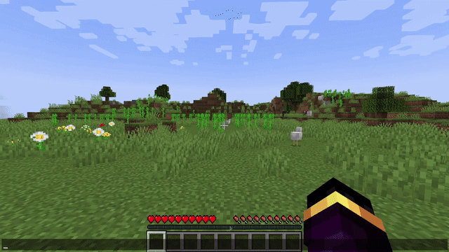
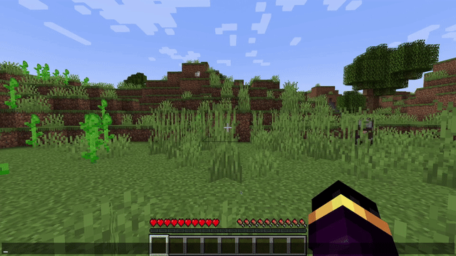
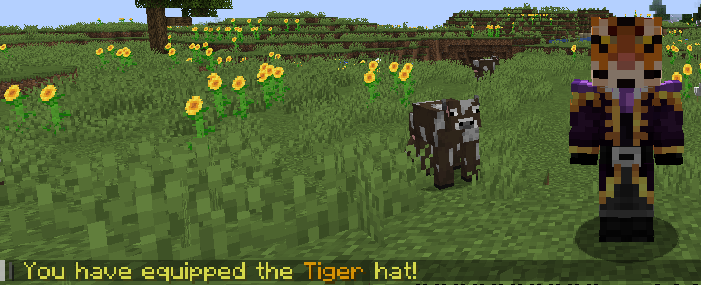

# Cosmetics

> A very simple Minecraft cosmetics plugin featuring hats and trails!

## Gallery

### Cosmetics

## License

&copy; 2024-2025 [Esoteric Enderman](https://enderman.dev)

[Cosmetics](./) is licensed under the [AGPL 3.0](./LICENSE) only.

## Topics

[minecraft](https://github.com/topics/minecraft), [minecraft-plugin](https://github.com/topics/minecraft-plugin), [cosmetic](https://github.com/topics/cosmetic), [paper-plugin](https://github.com/topics/paper-plugin), [paper-minecraft](https://github.com/topics/paper-minecraft), [cosmetics](https://github.com/topics/cosmetics), [minecraft-plugins](https://github.com/topics/minecraft-plugins), [mc-development](https://github.com/topics/mc-development), [papermc](https://github.com/topics/papermc), [minecraft-papermc-server](https://github.com/topics/minecraft-papermc-server), [minecraft-plugin-development](https://github.com/topics/minecraft-plugin-development), [papermc-plugin](https://github.com/topics/papermc-plugin), [mc-plugin](https://github.com/topics/mc-plugin), [papermc-plugins](https://github.com/topics/papermc-plugins), [minecraft-paper](https://github.com/topics/minecraft-paper), [paper-plugins](https://github.com/topics/paper-plugins), [minecraft-cosmetic](https://github.com/topics/minecraft-cosmetic), [mc-plugins](https://github.com/topics/mc-plugins), [minecraft-paper-plugin](https://github.com/topics/minecraft-paper-plugin), [paper-plugin-development](https://github.com/topics/paper-plugin-development)
